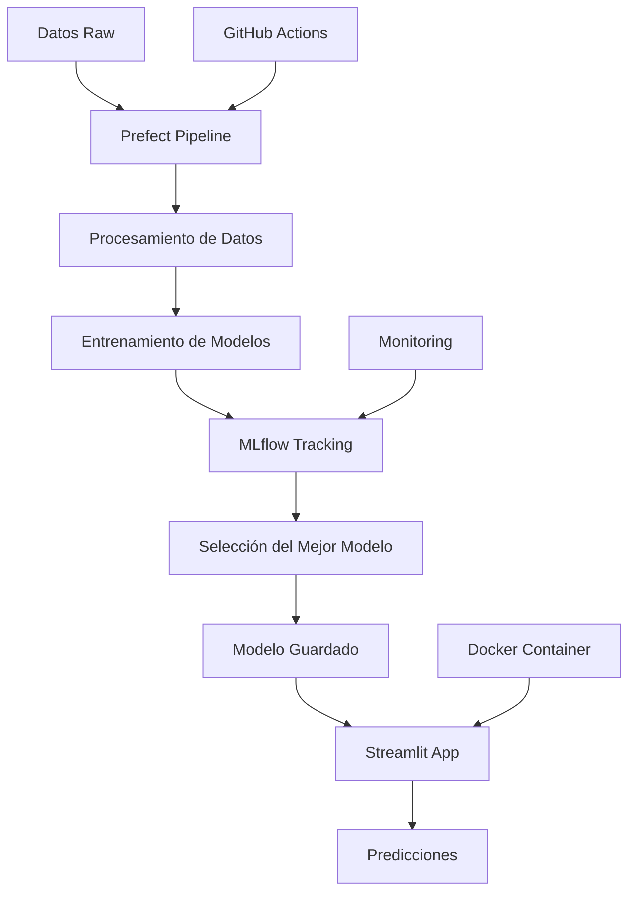

# 🍔 Restaurant Sales MLOps Pipeline

Un pipeline completo de MLOps para la predicción de ventas de restaurantes, implementado con Prefect, MLflow y Streamlit.


## 📋 Tabla de Contenidos

- [🎯 Descripción del Proyecto](#-descripción-del-proyecto)
- [🏗️ Arquitectura](#️-arquitectura)
- [📁 Estructura del Proyecto](#-estructura-del-proyecto)
- [🚀 Instalación](#-instalación)
- [💻 Uso](#-uso)
- [🔧 Configuración](#-configuración)
- [📊 Modelos y Métricas](#-modelos-y-métricas)
- [🌐 Aplicación Web](#-aplicación-web)
- [🧪 Testing](#-testing)
- [📈 Monitoreo](#-monitoreo)
- [🐳 Docker](#-docker)
- [🤝 Contribución](#-contribución)
- [📄 Licencia](#-licencia)

## 🎯 Descripción del Proyecto

Este proyecto implementa un pipeline completo de Machine Learning Operations (MLOps) para predecir las ventas de restaurantes basándose en variables como precio y cantidad. El sistema incluye:

- **Pipeline automatizado** de procesamiento de datos y entrenamiento
- **Múltiples algoritmos** de ML con selección automática del mejor modelo
- **Tracking de experimentos** con MLflow
- **Aplicación web interactiva** con Streamlit
- **Monitoreo** y logging del rendimiento
- **Containerización** con Docker

### 🎯 Objetivos

- Automatizar el proceso de entrenamiento de modelos ML
- Implementar mejores prácticas de MLOps
- Proporcionar una interfaz fácil de usar para predicciones
- Facilitar el monitoreo y mantenimiento del modelo

## 🏗️ Arquitectura



### 🔧 Componentes Principales

1. **Data Pipeline**: Prefect para orquestación
2. **ML Training**: Scikit-learn con múltiples algoritmos
3. **Experiment Tracking**: MLflow para seguimiento
4. **Web App**: Streamlit para interfaz de usuario
5. **Containerization**: Docker para deployment
6. **CI/CD**: GitHub Actions para automatización

## 📁 Estructura del Proyecto

```
restaurant-sales-mlops/
├── 📂 data/
│   ├── 📂 raw/                     # Datos sin procesar
│   ├── 📂 processed/               # Datos procesados
│   └── 📂 outputs/                 # Modelos y resultados
├── 📂 src/
│   ├── 📂 data_processing/
│   │   ├── __init__.py
│   │   └── preprocess.py           # Scripts de procesamiento
│   ├── 📂 training/
│   │   ├── __init__.py
│   │   └── train.py                # Scripts de entrenamiento
│   ├── 📂 monitoring/
│   │   ├── __init__.py
│   │   └── monitor.py              # Scripts de monitoreo
│   └── 📂 app/
│       ├── __init__.py
│       └── streamlit_app.py        # Aplicación Streamlit
├── 📂 workflows/
│   └── pipeline.py                 # Pipeline principal de Prefect
├── 📂 tests/                       # Tests unitarios
├── 📂 .github/workflows/           # GitHub Actions
├── 🐳 Dockerfile                   # Configuración Docker
├── 📋 requirements.txt             # Dependencias Python
├── 📋 setup.py                     # Configuración del paquete
├── 🔧 run_all.py                   # Script de ejecución completa
└── 📖 README.md                    # Este archivo
```

## 🚀 Instalación

### Prerrequisitos

- Python 3.8 o superior
- Git
- Docker (opcional)

### 1. Clonar el Repositorio

```bash
git clone https://github.com/tu-usuario/restaurant-sales-mlops.git
cd restaurant-sales-mlops
```

### 2. Crear Entorno Virtual

```bash
# Usando conda
conda create -n restaurant-mlops python=3.9
conda activate restaurant-mlops

# O usando venv
python -m venv venv
source venv/bin/activate  # En Windows: venv\Scripts\activate
```

### 3. Instalar Dependencias

```bash
# Instalar dependencias
pip install -r requirements.txt

# Instalar el proyecto en modo desarrollo
pip install -e .
```

### 4. Configurar Directorios

```bash
# Crear estructura de directorios
mkdir -p data/{raw,processed,outputs}
mkdir -p notebooks tests
```

## 💻 Uso

### 🔄 Ejecución Completa (Recomendado)

```bash
# Ejecutar todo el pipeline
python run_all.py
```

### 📊 Ejecución Paso a Paso

#### 1. Ejecutar Pipeline de Entrenamiento

```bash
# Opción A: Como módulo
python -m workflows.pipeline

# Opción B: Directamente
python workflows/pipeline.py
```

#### 2. Iniciar Aplicación Streamlit

```bash
streamlit run src/app/streamlit_app.py
```

#### 3. Acceder a MLflow UI

```bash
# En otra terminal
mlflow ui

# Abrir en navegador: http://localhost:5000
```

### 🎯 Realizar Predicciones

Una vez iniciada la aplicación Streamlit:

1. Abrir http://localhost:8501
2. Ingresar precio del producto
3. Ingresar cantidad vendida
4. Hacer clic en "Predecir Ventas Totales"
5. Revisar resultados y análisis

## 🔧 Configuración

### Variables de Entorno

Crear archivo `.env` en la raíz del proyecto:

```bash
# MLflow Configuration
MLFLOW_TRACKING_URI=http://localhost:5000
MLFLOW_EXPERIMENT_NAME=restaurant-sales

# Data Paths
DATA_RAW_PATH=data/raw
DATA_PROCESSED_PATH=data/processed
MODEL_OUTPUT_PATH=data/outputs

# Streamlit Configuration
STREAMLIT_SERVER_PORT=8501
STREAMLIT_SERVER_ADDRESS=localhost
```

### Configuración de MLflow

```python
# En src/training/train.py
import mlflow

# Configurar tracking URI
mlflow.set_tracking_uri("http://localhost:5000")
mlflow.set_experiment("restaurant-sales")
```

### Configuración de Prefect

```python
# En workflows/pipeline.py
from prefect import flow, task
from prefect.deployments import Deployment

# Configurar deployment
deployment = Deployment.build_from_flow(
    flow=main_pipeline,
    name="restaurant-sales-training",
    schedule=CronSchedule(cron="0 2 * * *")  # Diario a las 2 AM
)
```

## 📊 Modelos y Métricas

### 🤖 Algoritmos Implementados

| Modelo | Descripción | Casos de Uso |
|--------|-------------|--------------|
| **Linear Regression** | Regresión lineal simple | Baseline, interpretabilidad |
| **Ridge Regression** | Regresión con regularización L2 | Prevenir overfitting |
| **Lasso Regression** | Regresión con regularización L1 | Selección de features |
| **Random Forest** | Ensemble de árboles de decisión | Mayor precisión, robustez |

### 📈 Métricas de Evaluación

- **R² Score**: Coeficiente de determinación
- **RMSE**: Error cuadrático medio

### 🎯 Resultados

```
🤖 Entrenando modelos...
   🔧 Entrenando LinearRegression...
   ✅ LinearRegression → R²: 0.934, RMSE: 592.165
   🔧 Entrenando Ridge...
   ✅ Ridge → R²: 0.934, RMSE: 592.328
   🔧 Entrenando Lasso...
   ✅ Lasso → R²: 0.934, RMSE: 592.171
   🔧 Entrenando RandomForest...
   ✅ RandomForest → R²: 0.931, RMSE: 605.341

```

## 🌐 Aplicación Web

### ✨ Características

- **Dashboard Interactivo**: Visualizaciones en tiempo real
- **Predicciones Instantáneas**: Resultados inmediatos
- **Análisis de Sensibilidad**: Impacto de variables
- **Métricas del Modelo**: Información detallada
- **Diseño Responsivo**: Compatible con móviles


## 🧪 Testing

### Ejecutar Tests

```bash
# Todos los tests
pytest tests/

# Tests específicos
pytest tests/test_preprocess.py -v

# Con coverage
pytest tests/ --cov=src --cov-report=html
```

### Estructura de Tests

```
tests/
└── test_preprocess.py       # Tests de procesamiento
```

### Ejemplo de Test

```python
import pytest
from src.training.train import train_model

def test_train_model():
    """Test del entrenamiento de modelo"""
    model = train_model()
    assert model is not None
    assert hasattr(model, 'predict')
```

## 📈 Monitoreo

### 📊 Métricas Monitoreadas

- **Rendimiento del Modelo**: R², RMSE, drift
- **Calidad de Datos**: Completitud, consistencia
- **Performance del Sistema**: Latencia, throughput
- **Errores**: Excepciones, fallos de predicción


### 📊 Dashboard de Monitoreo

Acceder a métricas en tiempo real:
- **MLflow UI**: http://localhost:5000
- **Prefect UI**: http://localhost:4200
- **Streamlit**: http://localhost:8501

## 🐳 Docker

### 🏗️ Construcción de Imagen

```bash
# Construir imagen
docker build -t restaurant-sales-mlops .

# Ver imágenes
docker images
```

### 🚀 Ejecución con Docker

```bash
# Ejecutar contenedor
docker run -p 8501:8501 restaurant-sales-mlops

# Con volúmenes (para persistir datos)
docker run -p 8501:8501 \
  -v $(pwd)/data:/app/data \
  restaurant-sales-mlops
```


## 🔄 CI/CD con GitHub Actions

### 📋 Workflow Principal

```yaml
# .github/workflows/ci.yml
name: CI

on: [push]

jobs:
  test:
    runs-on: ubuntu-latest
    steps:
      - uses: actions/checkout@v3
      - name: Set up Python
        uses: actions/setup-python@v4
        with:
          python-version: "3.10"
      - name: Install dependencies
        run: pip install -r requirements.txt
      - name: Run tests
        run: pytest

```

## 🚀 Despliegue en Producción

### ☁️ Opciones de Despliegue

1. **Streamlit Cloud**: Despliegue gratuito y fácil
2. **Heroku**: Platform as a Service
3. **AWS/GCP/Azure**: Cloud providers
4. **Kubernetes**: Para escalabilidad avanzada

### ⚙️ Configuración para Producción

```bash
# Configurar variables de entorno
export ENVIRONMENT=production
export DEBUG=false
export DATABASE_URL=your_database_url

# Iniciar aplicación
streamlit run src/app/streamlit_app.py --server.port=$PORT
```

## 🔧 Troubleshooting

### ❌ Problemas Comunes

#### Error de Importación de Módulos
```bash
# Solución
export PYTHONPATH="${PYTHONPATH}:$(pwd)"
pip install -e .
```

#### MLflow UI No Inicia
```bash
# Verificar puerto
lsof -i :5000
# Cambiar puerto
mlflow ui --port 5001
```

#### Streamlit No Carga
```bash
# Verificar instalación
streamlit --version
# Reinstalar
pip install --upgrade streamlit
```


## 📄 Licencia

Este proyecto está licenciado bajo la Licencia MIT - ver el archivo [LICENSE](LICENSE) para detalles.

```
MIT License

Copyright (c) 2024 Tu Nombre

Permission is hereby granted, free of charge, to any person obtaining a copy
of this software and associated documentation files (the "Software"), to deal
in the Software without restriction, including without limitation the rights
to use, copy, modify, merge, publish, distribute, sublicense, and sell
copies of the Software, and to permit persons to whom the Software is
furnished to do so, subject to the following conditions:

The above copyright notice and this permission notice shall be included in all
copies or substantial portions of the Software.

THE SOFTWARE IS PROVIDED "AS IS", WITHOUT WARRANTY OF ANY KIND, EXPRESS OR
IMPLIED, INCLUDING BUT NOT LIMITED TO THE WARRANTIES OF MERCHANTABILITY,
FITNESS FOR A PARTICULAR PURPOSE AND NONINFRINGEMENT. IN NO EVENT SHALL THE
AUTHORS OR COPYRIGHT HOLDERS BE LIABLE FOR ANY CLAIM, DAMAGES OR OTHER
LIABILITY, WHETHER IN AN ACTION OF CONTRACT, TORT OR OTHERWISE, ARISING FROM,
OUT OF OR IN CONNECTION WITH THE SOFTWARE OR THE USE OR OTHER DEALINGS IN THE
SOFTWARE.
```

</div>